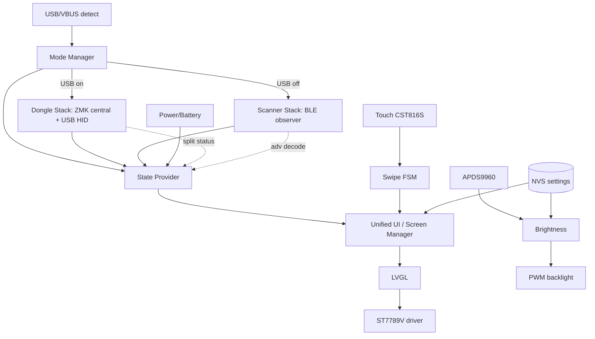
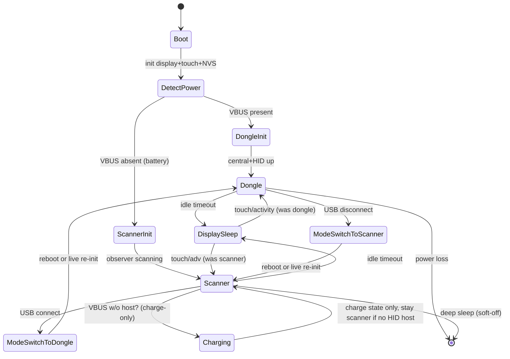

# Hybrid Prospector Firmware — Clean-Room Implementation Specification

Target repos (fresh, currently empty):
- `prospector-touch-zmk-module` — ZMK module (drivers, BLE, UI, scanner, dongle, touch).
- `zmk-config-prospector-touch` — user config that builds the firmware.

Hardware base: Seeeduino XIAO BLE (nRF52840) + ST7789V 1.69" LCD + CST816S touch + APDS9960 ALS. Keyboard target: TOTEM (GEISTGIEST) split.

> Clean-room rule: this spec describes **behavior, APIs, data formats, config, architecture**. No source copied from upstream repos. Reimplement every `.c` from the behavioral description here.

---

## 1. Executive Summary

Goal: one firmware image, two runtime modes, auto-selected by USB power. No reflash, no build variants, no user action.

- **USB present** → **Dongle mode**: device is the keyboard's BLE split central + USB HID dongle (original carrefinho Prospector behavior). Reads keyboard state directly via local ZMK APIs.
- **USB absent + battery** → **Scanner mode**: device is a passive BLE observer (t-ogura behavior). Reads keyboard state from 26-byte manufacturer advertisements. No pairing, no connection slot consumed.

Touch works in both modes. One unified UI, fed by a mode-agnostic **state provider** that abstracts "where state comes from".

Three source projects analyzed:
1. **Core / Dongle** — `carrefinho/prospector-zmk-module` (`feat/new-status-screens`, Zephyr 4.1). Central+HID dongle, 3 widgets (layer roller, battery bar, caps-word), ambient brightness, custom split-central status event.
2. **Scanner+Touch** — `t-ogura/prospector-zmk-module` v2.2.1 + `zmk-config-prospector`. BLE observer, status advertisement protocol, 4 layouts, touch (CST816S), swipe nav, settings screens, NVS persistence, channel filter, multi-keyboard, WPM, RSSI, modifiers, version protocol.
3. **UI inspiration** — `janpfischer/zmk-dongle-screen` (YADS). Independent per-widget dongle UI (output/layer/mod/wpm/battery), Kconfig-togglable composition, keyboard-controlled brightness keycodes.

Key architectural insight: in Dongle mode the device **is** the central, so it owns keyboard state. In Scanner mode it watches a *different* setup's adverts. Modes are mutually exclusive at the BLE-role level and cleanly keyed off USB presence.

---

## 2. Repository Comparison Matrix

| Aspect | Core/Dongle (carrefinho) | Scanner (t-ogura) | YADS (janpfischer) | Hybrid (new) |
|---|---|---|---|---|
| BLE role | Central + Observer(for split) | Observer only | Central(dongle) | Central+HID **and** Observer, mode-switched |
| Data source | Local ZMK APIs (is central) | 26-byte manuf adverts | Local ZMK APIs | Both via state provider |
| USB HID | Yes | No | Yes | Yes (dongle mode) |
| Pairing needed | Yes (split central) | No | Yes | Dongle: yes / Scanner: no |
| Display | ST7789V 240×280 portrait, ROTATED_270 | ST7789V 280×240, MDAC 0x60 | ST7789 (config orient) | ST7789V, single unified orientation |
| Touch | None | CST816S I2C0 @0x15 | None | CST816S (both modes) |
| ALS | APDS9960 @0x39 INT D2 | APDS9960 @0x39 INT P0.09 | APDS9960 optional | APDS9960 @0x39 (verify INT pin) |
| Widgets | layer_roller, battery_bar, caps_word | 4 layouts (Classic/Field/Operator/Radii) + settings | output/layer/mod/wpm/battery | unified UI, all of above |
| Layouts | 1 (roller) | 4 | 1 | ≥4 + dongle view |
| Settings UI | No (Kconfig only) | Yes (swipe + NVS) | No (keycodes) | Yes (touch + NVS) |
| Persistence | None | NVS (`prosp/*` keys) | None | NVS |
| WPM | No | Yes (rolling window) | Yes (zmk_wpm) | Yes |
| RSSI | No | Yes (per adv) | No | Yes (scanner mode) |
| Channel filter | No | Yes (0–255) | No | Yes (scanner mode) |
| Multi-keyboard | No | Yes (1–5, default 3) | No | Yes (scanner mode) |
| Zephyr | 3.5 (main: 4.1) | 3.5 + 4.x dual | 4.x | 4.x (ZMK main) |
| Module Kconfig syms | 4 | ~30 | ~25 (`DONGLE_SCREEN_*`) | superset |
| board id | `xiao_ble//zmk` | `xiao_ble/nrf52840/zmk` | `xiao_ble`/`nice_nano_v2` | `xiao_ble/nrf52840/zmk` |
| west ZMK rev | `main` | `main` | `main` | `main` |

---

## 3. Feature Comparison Matrix

Legend: ✅ present · ⛔ absent · ➕ becomes common in hybrid.

| Feature | Dongle | Scanner | YADS | Hybrid disposition |
|---|---|---|---|---|
| Highest active layer | ✅ roller | ✅ multi-style | ✅ 40pt | ➕ common (state provider) |
| Layer `display-name` | ✅ | ✅ (4-char adv) | ✅ | ➕ common |
| Layer slide animation | ⛔ | ✅ (dir-aware) | ⛔ | ➕ common (toggle) |
| Peripheral battery | ✅ bar (pair order) | ✅ `peripheral_battery[3]` | ✅ canvas bars | ➕ common |
| Central/self battery | ✅ | ✅ (opt) | opt | ➕ common |
| Charging status | ⛔ | ✅ flag | ✅ | ➕ common |
| Caps word | ✅ indicator | ✅ flag | ⛔ | ➕ common |
| Modifiers | ⛔ | ✅ 8-bit | ✅ icons | ➕ common |
| WPM | ⛔ | ✅ window+decay | ✅ | ➕ common |
| Connection status | ✅ split central event | ✅ flags+count | ✅ output widget | ➕ common |
| BLE profile/slot | ⛔(implicit) | ✅ profile_slot | ✅ 1–5 | ➕ common |
| USB vs BLE transport | n/a (is USB) | ✅ flags | ✅ arrow | dongle: local / scanner: flags |
| RSSI | ⛔ | ✅ | ⛔ | scanner-only |
| Multi-keyboard | ⛔ | ✅ | ⛔ | scanner-only |
| Channel filter | ⛔ | ✅ | ⛔ | scanner-only |
| FW version protocol | ⛔ | ✅ adv-encoded | ⛔ | scanner-only display; dongle local |
| Ambient brightness | ✅ APDS9960 | ✅ APDS9960 | ✅ opt | ➕ common |
| Manual brightness | ⛔ (fixed Kconfig) | ✅ slider+NVS | ✅ keycodes | ➕ common (touch+keycode) |
| Touch swipe nav | ⛔ | ✅ 4-way+tap | ⛔ | ➕ common (both modes) |
| Settings screens | ⛔ | ✅ | ⛔ | ➕ common |
| Bootloader/reset action | ⛔ | ✅ Quick Actions | ⛔ | ➕ common |
| Idle screen off | ⛔ | ✅ activity-based | ✅ timeout | ➕ common |
| Display layouts (≥4) | ⛔ | ✅ | ⛔ | ➕ common |

Disposition summary:
- **Reusable as-is (concept):** layer roller, battery bar, caps-word, ambient brightness (dongle); all 4 layouts, touch stack, settings, NVS, channel, multi-kb, version protocol (scanner); per-widget composition + brightness keycodes (YADS).
- **Scanner-only:** RSSI, channel filter, multi-keyboard, adv-decoded FW version, observer scan loop.
- **Dongle-only:** USB HID, split central, local-API data path.
- **Should become common:** unified state struct, touch nav, settings UI, NVS, brightness control, all layouts, WPM, modifiers, charging, connection indicators.

---

## 4. File-by-File Migration Table

Classes: **Concept** (reimplement from behavior) · **Rewrite** (heavy change) · **Replace** (swap impl) · **Split** · **Merge** · **Delete** · **Deprecate**. G=generic, K=keyboard-specific. R=required, O=optional.

### 4.1 Core/Dongle module (`carrefinho/prospector-zmk-module`)

| File | Purpose | Action | G/K | R/O | Notes |
|---|---|---|---|---|---|
| `Kconfig` (4 syms) | brightness/rotate/caps opts | Merge → unified Kconfig | G | R | superset with scanner syms |
| `CMakeLists.txt` | gate sources on shield | Rewrite | G | R | gate on new shield + mode syms |
| `zephyr/module.yml` | module decl, depends lvgl | Concept | G | R | same shape |
| `config/west.yml` | ZMK main import | Concept | G | R | identical pattern |
| `drivers/display/display_st7789v.{c,h}` | vendored ST7789V | Replace | G | R | reuse one vendored copy (both repos carry it) |
| `modules/lvgl/lvgl.c` + CMake | LVGL glue | Replace | G | R | single copy |
| `boards/shields/prospector_adapter/Kconfig.shield` | shield sym | Concept | G | R | → `prospector_touch` shield |
| `…/Kconfig.defconfig` | display/LVGL defaults, split batt fetch | Merge | G | R | fold into hybrid defconfig |
| `…/prospector_adapter.conf` | (all commented) | Delete | G | O | no live content |
| `…/prospector_adapter.overlay` | chosen display | Merge | G | R | into hybrid overlay |
| `…/boards/seeeduino_xiao_ble.overlay` | st7789 spi3, pwm1 BL, apds9960 | Rewrite | G | R | unify pins, add CST816S |
| `…/src/custom_status_screen.c` | compose 3 widgets | Rewrite→Merge | G | R | becomes "dongle view" of unified UI |
| `…/src/brightness.c` | ALS thread, PWM fade | Concept | G | R | merge with scanner brightness_control |
| `…/src/display_rotate_init.c` | SYS_INIT orientation | Concept | G | R | unify orientation choice |
| `…/src/widgets/layer_roller.{c,h}` | roller layer widget | Concept | G | O | one of unified layouts |
| `…/src/widgets/battery_bar.{c,h}` | peripheral batt bar | Concept | G | R | common widget |
| `…/src/widgets/caps_word_indicator.{c,h}` | caps word | Concept | G | O | common widget |
| `…/src/widgets/CMakeLists.txt` | widget build | Rewrite | G | R | |
| `…/src/fonts/*` (Foundry/FRAC/SF) | display fonts | Concept | G | O | keep needed subset |
| `…/include/{fonts.h,sf_symbols.h}` | font/glyph decls | Concept | G | O | merge glyph sets |
| `include/zmk/events/caps_word_state_changed.h` | caps event | Concept | G | O | fills upstream gap |
| `include/zmk/events/split_central_status_changed.h` | split status event | Concept | G | R | dongle connection UI |
| `src/events/caps_word_state_changed.c` | event impl | Concept | G | O | |
| `src/events/split_central_status_changed.c` | event impl | Concept | G | R | |
| `src/behaviors/behavior_caps_word.c` | caps word behavior hook | Concept | G | O | gated on caps-word present |
| `src/split/bluetooth/central_status_changed_observer.c` | peripheral conn observer | Concept | G | R | dongle mode |

### 4.2 Scanner module (`t-ogura/prospector-zmk-module`)

| File | Purpose | Action | G/K | R/O | Notes |
|---|---|---|---|---|---|
| `include/zmk/status_advertisement.h` | 26-byte adv protocol, version/mod/flag macros | Concept | G | R | **protocol spec — reproduce exactly** (§17.1) |
| `src/status_advertisement.c` | encode + 3-mode hybrid ADV, burst, WPM, listeners | Concept | G | R | keyboard-side; only needed if hybrid also broadcasts. Optional for display device |
| `include/zmk/status_scanner.h` | observer API + `zmk_keyboard_status` | Concept | G | R | scanner core |
| `src/status_scanner.c` | scan cb, filter, ring buffer, multi-kb, RSSI | Concept | G | R | scanner core |
| `include/zmk/prospector_compat.h` | Zephyr 3.5/4.x SYS_INIT shim | Concept | G | O | drop if 4.x-only |
| `boards/shields/prospector_scanner/Kconfig.shield` | shield sym | Merge | G | R | one hybrid shield |
| `…/Kconfig.defconfig` | display/LVGL/scanner defaults | Merge | G | R | |
| `…/prospector_scanner.conf` | scanner CONFIG set | Merge | G | R | into hybrid conf |
| `…/prospector_scanner.keymap` | empty (no keys) + dummy kscan | Rewrite | K | R | hybrid needs real central kscan? (mock for dongle) |
| `…/prospector_scanner.overlay` | st7789 + CST816S + apds9960 + pwm | Merge | G | R | unify with dongle overlay |
| `…/include/fonts.h` | NerdFont glyph decls | Concept | G | O | |
| `…/src/touch_handler.{c,h}` | CST816S read, coord transform, software swipe | Concept | G | R | touch core |
| `…/src/events/swipe_gesture_event.{c,h}` | swipe event | Concept | G | R | |
| `…/src/events/scanner_update_event.{c,h}` | scanner→UI event | Concept | G | R | |
| `…/src/custom_status_screen.c` | screen manager, swipe→screen FSM | Rewrite→Merge | G | R | unified screen manager |
| `…/src/prospector_layouts.{c,h}` | layout engine, cycle, palette | Concept | G | R | |
| `…/src/field_layout.{c,h}` | WPM-animated grid | Concept | G | O | |
| `…/src/operator_layout.{c,h}` | minimalist dots/arc | Concept | G | O | |
| `…/src/radii_layout.{c,h}` | circular wheel | Concept | G | O | |
| `…/src/display_settings.{c,h}` | NVS persistence (`prosp/*`) | Concept | G | R | |
| `…/src/brightness_control.{c,h}` | auto/manual brightness, ALS map | Concept | G | R | merge with dongle brightness.c |
| `…/src/backlight_init.c` | PWM/LED init | Concept | G | R | |
| `…/src/system_settings_widget.{c,h}` | system settings UI + runtime channel | Concept | G | O | |
| `…/src/hello_widget.{c,h}` | boot/name widget | Concept | G | O | |
| `…/src/scanner_stub.{c,h}` | data bridge, pending updates | Concept | G | R | state provider seam |
| `…/src/field_layout.c` palettes | color cycling | Concept | G | O | |
| `…/src/fonts/*`, `fonts_carrefinho/*` | display fonts | Concept | G | O | keep subset |
| `dts/behaviors/settings_toggle.dtsi` | settings-toggle behavior | Concept | G | O | dongle keymap can bind |
| `dts/bindings/behaviors/zmk,behavior-settings-toggle.yaml` | binding | Concept | G | O | |

### 4.3 YADS (`janpfischer/zmk-dongle-screen`) — inspiration only

| File | Concept to borrow | Action | Notes |
|---|---|---|---|
| `src/widgets/output_status.c` | transport+conn+profile color logic | Concept | dongle-view output widget |
| `src/widgets/mod_status.c` | 100ms HID poll → mod icons | Concept | dongle mode mod source |
| `src/widgets/wpm_status.c` | `zmk_wpm_state_changed` | Concept | dongle mode WPM |
| `src/widgets/battery_status.c` | canvas batt bars + disconnect "X" | Concept | bar style option |
| `src/widgets/layer_status.c` | 40pt layer name | Concept | layout option |
| `Kconfig.defconfig` `DONGLE_SCREEN_*` | per-widget toggles, brightness keycodes, idle timeout | Concept | hybrid Kconfig naming |
| `custom_status_screen.c` | Kconfig-gated widget composition | Concept | composition pattern |

### 4.4 TOTEM config (`zmk-config-totem-prospector`) — keyboard side

| File | Purpose | Action | Notes |
|---|---|---|---|
| `build.yaml` | left/right/dongle(+prospector_adapter)/reset | Rewrite | swap `prospector_adapter`→`prospector_touch`; dongle becomes hybrid |
| `config/west.yml` | ZMK main + carrefinho `feat/new-status-screens` | Rewrite | point at new `prospector-touch-zmk-module` |
| `config/totem.conf` | TX pwr+8, exp conn, split batt fetch+proxy | Concept | keep |
| `…/totem_dongle.conf` | `CENTRAL_PERIPHERALS=2`, `SLEEP=n`, `STATUS_SCREEN_OPERATOR=y` | Rewrite | dongle = hybrid display; if adv-broadcast wanted add `ZMK_STATUS_ADVERTISEMENT=y` |
| `…/totem_left.conf` / `totem_right.conf` | empty | Concept | add `ZMK_STATUS_ADVERTISEMENT` only if peripherals broadcast (not needed) |
| `config/totem.keymap` (halves) 6 layers | Base/Nav/Sym/Fun/Game/Game+ | Concept (K) | display renders names |
| `…/shields/totem/totem.keymap` (dongle) 10 layers | Base/Media/Nav/Mouse/Sym/Num/Fun/Button/Game/Gameplus | Concept (K) | dongle-central layer source |
| `…/totem.dtsi` | matrix 10×4, col2row | Concept (K) | unchanged |
| `…/totem_{left,right,dongle}.overlay` | GPIO, mock_kscan dongle | Concept (K) | unchanged |
| `…/Kconfig.defconfig`/`Kconfig.shield`/`totem.zmk.yml`/`info.json` | shield meta/roles | Concept (K) | unchanged |
| `.github/workflows/build.yml` | reusable ZMK CI | Concept | unchanged |

---

## 5. Architecture (text)

### 5.1 Layered modules

```
┌──────────────────────────── Application ────────────────────────────┐
│  Mode Manager (boot detect + runtime USB events)                     │
│  Screen Manager (swipe FSM, page routing, idle/wake)                 │
│  Unified UI (layouts, widgets, settings screens)                    │
├──────────────── State Provider (mode-agnostic facade) ──────────────┤
│   Dongle source            │            Scanner source               │
│   (local ZMK APIs)         │      (status_scanner adverts)           │
├──────────────┬─────────────┴───────────────┬───────────────────────-┤
│ Dongle stack │        Common services       │     Scanner stack       │
│ ZMK central  │ Brightness · NVS settings ·  │ BLE observer · adv      │
│ USB HID      │ Touch (CST816S) · Display ·  │ decode · ring buffer ·  │
│ split status │ LVGL · Fonts · Power/Battery │ multi-kb · RSSI ·       │
│ events       │                              │ channel filter          │
├──────────────┴──────────────────────────────┴──────────────────────-┤
│ Drivers: ST7789V (SPI) · CST816S (I2C+INT) · APDS9960 (I2C) ·        │
│          PWM backlight · VBAT ADC · USB/VBUS detect                  │
├─────────────────────────────────────────────────────────────────────┤
│ Zephyr (nRF52840) + ZMK core + LVGL 9                               │
└─────────────────────────────────────────────────────────────────────┘
```

### 5.2 Dependency graph



Interaction rules:
- UI never reads ZMK or scanner directly — only the **State Provider** (`prospector_state_get()` returning unified `prospector_keyboard_data`).
- Mode Manager owns subsystem lifecycle: starts observer in scanner mode; activates HID/central path in dongle mode.
- Touch + brightness + NVS + display are mode-independent (always active).

---

## 6. Runtime State Machine



States & transitions:

| State | Entry action | Exit event | Next |
|---|---|---|---|
| Boot | init clocks, display, LVGL, touch, NVS, settings load | init done | DetectPower |
| DetectPower | sample VBUS (`NRF_POWER->USBREGSTATUS` / `zmk_usb_is_powered`) | VBUS=1 / VBUS=0 | DongleInit / ScannerInit |
| DongleInit | enable ZMK split central + USB HID, subscribe local events | ready | Dongle |
| ScannerInit | `zmk_status_scanner_init/start`, register adv callback | ready | Scanner |
| Dongle | render dongle-fed UI, update on ZMK events | idle→sleep; USB drop | DisplaySleep; ModeSwitchToScanner |
| Scanner | render adv-fed UI, update on scanner events | idle→sleep; USB attach | DisplaySleep; ModeSwitchToDongle |
| DisplaySleep | backlight off, LVGL paused, keep BLE | touch INT / new adv / key activity | resume prior mode |
| Charging | show charge indicator | charge done / unplug | prior mode |
| ModeSwitch* | persist NVS, stop current subsystems | re-init done | target mode |

Power transitions:
- **USB→battery (disconnect):** stop HID, drop split central, start observer. Robust path = controlled reboot (clean BLE stack re-init). Live path = stop `bt` central activity, `bt_le_scan_start` observer (advanced, §16).
- **battery→USB (connect):** stop observer, bring up central+HID. Same reboot-vs-live tradeoff.
- **Deep sleep / soft-off:** scanner mode only; wake on touch INT (GPIO) or power button.

Failure recovery:
- Scanner stall → watchdog/work-handler re-arm; ring-buffer overflow drops adverts (non-fatal).
- BLE recovery → on `bt_enable` failure retry with backoff; on observer error restart scan.
- Display fault → re-run ST7789V init SYS_INIT path.
- USB enumeration fail in dongle mode → remain dongle (central still valid) but mark HID-not-ready.

---

## 7. Source Tree (new `prospector-touch-zmk-module`)

```
prospector-touch-zmk-module/
├── CMakeLists.txt                 # gate all sources on SHIELD_PROSPECTOR_TOUCH + mode syms
├── Kconfig                        # unified module Kconfig (dongle+scanner+touch+UI)
├── zephyr/module.yml              # name, cmake ., kconfig Kconfig, board_root ., depends: lvgl
├── config/west.yml                # ZMK main import (module-local manifest)
├── README.md
├── drivers/
│   └── display/
│       ├── CMakeLists.txt
│       ├── display_st7789v.c      # vendored ST7789V (single copy)
│       └── display_st7789v.h
├── modules/lvgl/                  # LVGL glue (single copy)
│   ├── CMakeLists.txt
│   └── lvgl.c
├── include/zmk/
│   ├── status_advertisement.h     # 26-byte protocol + macros (shared encode/decode)
│   ├── status_scanner.h           # observer API + zmk_keyboard_status
│   ├── prospector_state.h         # NEW unified state provider facade
│   ├── prospector_mode.h          # NEW mode manager API
│   └── events/
│       ├── caps_word_state_changed.h
│       └── split_central_status_changed.h
├── src/
│   ├── mode/
│   │   ├── mode_manager.c          # VBUS detect, lifecycle, USB event sub
│   │   └── usb_detect.c            # VBUS sampling + zmk_usb_conn_state_changed
│   ├── state/
│   │   ├── state_provider.c        # facade → unified prospector_keyboard_data
│   │   ├── source_dongle.c         # local ZMK APIs → state
│   │   └── source_scanner.c        # adv decode/bridge → state (ex scanner_stub)
│   ├── ble/
│   │   ├── status_advertisement.c  # (optional) keyboard-side broadcast
│   │   └── status_scanner.c        # observer scan, filter, ring buffer, multi-kb
│   ├── events/
│   │   ├── caps_word_state_changed.c
│   │   └── split_central_status_changed.c
│   ├── split/bluetooth/
│   │   └── central_status_changed_observer.c
│   └── behaviors/
│       └── behavior_caps_word.c
├── dts/
│   ├── behaviors/settings_toggle.dtsi
│   └── bindings/behaviors/zmk,behavior-settings-toggle.yaml
└── boards/shields/prospector_touch/
    ├── CMakeLists.txt
    ├── Kconfig.shield              # SHIELD_PROSPECTOR_TOUCH
    ├── Kconfig.defconfig           # display/LVGL/scanner/touch defaults
    ├── prospector_touch.conf       # shipped defaults
    ├── prospector_touch.keymap     # dongle: mock or real kscan; scanner: dummy
    ├── prospector_touch.overlay    # st7789 + cst816s + apds9960 + pwm BL + vbat
    ├── boards/
    │   └── seeeduino_xiao_ble.overlay   # + xiao_ble alias if needed
    ├── include/{fonts.h,sf_symbols.h}
    └── src/
        ├── custom_status_screen.c   # screen manager (swipe FSM, idle/wake, mode view)
        ├── ui/
        │   ├── prospector_layouts.c/.h
        │   ├── field_layout.c/.h
        │   ├── operator_layout.c/.h
        │   ├── radii_layout.c/.h
        │   ├── dongle_view.c/.h       # ex carrefinho compose (roller+bar+caps)
        │   └── widgets/{layer_roller,battery_bar,caps_word_indicator}.c/.h
        ├── settings/
        │   ├── display_settings.c/.h  # NVS prosp/*
        │   ├── system_settings_widget.c/.h
        │   └── hello_widget.c/.h
        ├── touch/
        │   ├── touch_handler.c/.h
        │   └── events/{swipe_gesture_event,scanner_update_event}.c/.h
        ├── power/
        │   ├── brightness_control.c/.h   # auto(ALS)+manual+NVS, merges dongle brightness.c
        │   ├── backlight_init.c
        │   └── display_rotate_init.c
        └── fonts/ …
```

`zmk-config-prospector-touch/`:
```
build.yaml            # xiao_ble/nrf52840/zmk + prospector_touch (+ touch EXTRA_CONF), settings_reset
config/
  west.yml            # ZMK main + prospector-touch-zmk-module (this module)
  prospector_touch.conf
  prospector_touch.keymap
docs/
```

---

## 8. Required File Modifications (behavioral specs)

### 8.1 `mode/mode_manager.c` (NEW)
- `prospector_mode_init()` at `SYS_INIT(APPLICATION, ~95)` after display/touch.
- Sample VBUS: prefer ZMK `zmk_usb_is_powered()`; fallback raw `NRF_POWER->USBREGSTATUS & POWER_USBREGSTATUS_VBUSDETECT_Msk`.
- Set global `prospector_mode_t {DONGLE, SCANNER}`.
- Subscribe `zmk_usb_conn_state_changed`. On change vs current mode → call transition (default: `sys_reboot(COLD)` after `display_settings_save_if_dirty()`; live-switch behind `CONFIG_PROSPECTOR_LIVE_MODE_SWITCH`).
- Gate: dongle path only if `CONFIG_ZMK_USB`; scanner path only if `CONFIG_BT_OBSERVER`.

### 8.2 `state/state_provider.c` (NEW)
- Define unified `struct prospector_keyboard_data` (superset of scanner's; see §17.2).
- `const struct prospector_keyboard_data *prospector_state_get(int kb_index)`.
- In DONGLE mode populate from: `zmk_keymap_highest_layer_active`, `zmk_keymap_layer_name`, `zmk_battery_state_of_charge`, split peripheral battery (`zmk_split_…battery`), HID modifiers (`zmk_hid_get_keyboard_report`), `zmk_wpm_get_state`, endpoint/profile (`zmk_endpoints_selected`, `zmk_ble_active_profile_*`), caps-word event, split central status event.
- In SCANNER mode populate from `source_scanner.c` bridge (latest `zmk_status_adv_data` + rssi + name + version).
- Emit `scanner_update_event` equivalent to UI on change (single event path both modes).

### 8.3 `ble/status_scanner.c` (Concept)
- `bt_le_scan_start(BT_LE_SCAN_PASSIVE)` with cb `scan_callback(addr, rssi, type, buf)`.
- Parse AD: name (`BT_DATA_NAME_*`), manufacturer (`BT_DATA_MANUFACTURER_DATA`).
- Filter: `manufacturer_id==0xFFFF && service_uuid==0xABCD`.
- Channel filter logic (accept-all / ≥10 debug / kb-broadcast-0 / exact).
- Lock-free SPSC ring buffer (16, pow2, `__DMB()`); producer in BT RX, consumer in work-queue `scanner_process_incoming()`.
- `keyboards[CONFIG_PROSPECTOR_MAX_KEYBOARDS]`, timeout `CONFIG_PROSPECTOR_SCANNER_TIMEOUT_MS`, HWINFO/MAC keyed identity, LRU name cache.
- Emit FOUND/UPDATED/LOST.

### 8.4 `touch/touch_handler.c` (Concept)
- CST816S over I2C0 @0x15; INT GPIO (active-low) → work; RST GPIO.
- Read X/Y/event; map panel(240×280 portrait) → logical(280×240): `lx=y`, `ly=239-x` (verify vs final orientation).
- Software swipe FSM: thresholds — swipe ≥30px, tap move ≤10px, double-tap ≤350ms, cooldown 400ms, complete <500ms.
- Emit `zmk_swipe_gesture_event{UP,DOWN,LEFT,RIGHT,DOUBLE_TAP}`.
- Register LVGL indev (`lvgl_input_read`) for direct touch UI.
- Works in both modes (independent of BLE role).

### 8.5 `custom_status_screen.c` (Rewrite/Merge)
- `zmk_display_status_screen()` builds root, then screen manager.
- Screens enum: MAIN, DISPLAY_SETTINGS, SYSTEM_SETTINGS/QUICK_ACTIONS, KEYBOARD_SELECT, PROSPECTOR_DISPLAY (layouts). Plus DONGLE_VIEW for dongle mode default.
- Swipe FSM (from TOUCH_MODE.md) §17.3.
- MAIN view = unified UI fed by state provider (works both modes; hides scanner-only fields—RSSI/channel/multi-kb—in dongle mode).
- Idle/wake: activity timeout → backlight off; touch/adv/key → resume.

### 8.6 `power/brightness_control.c` (Merge dongle brightness.c + scanner brightness_control.c)
- Auto: APDS9960 `SENSOR_CHAN_LIGHT` → map → PWM via `led_set_brightness(pwmleds, DISP_BL, %)`; fade + burst sampling (dongle algo).
- Manual: slider 0–100 + NVS; auto/manual toggle (scanner).
- Optional keycode control (YADS): F22 toggle / F23 down / F24 up in dongle mode.

### 8.7 Events/behaviors (Concept)
- `caps_word_state_changed` event + `behavior_caps_word` hook (gated `CONFIG_DT_HAS_ZMK_BEHAVIOR_CAPS_WORD_ENABLED`) — fills upstream gap (no caps-word event to subscribe).
- `split_central_status_changed` + `central_status_changed_observer` — surface peripheral connect/disconnect on central for dongle UI.

---

## 9. ZMK Configuration Changes (`Kconfig` + `.conf`)

### 9.1 Unified module Kconfig (superset)
Mode/scanner/touch/UI symbols (defaults shown):

```
# Mode
config PROSPECTOR_MODE_AUTO              bool default y   # USB→dongle / batt→scanner
config PROSPECTOR_LIVE_MODE_SWITCH       bool default n   # live re-init vs reboot
# Scanner (depends BT_OBSERVER)
config PROSPECTOR_MODE_SCANNER           bool default y
config PROSPECTOR_MULTI_KEYBOARD         bool default y
config PROSPECTOR_MAX_KEYBOARDS          int  default 3   range 1 5
config PROSPECTOR_MAX_LAYERS             int  default 7   range 4 10
config PROSPECTOR_SCANNER_TIMEOUT_MS     int  default 480000 range 0 600000
config PROSPECTOR_SCANNER_MAIN_LOOP_INTERVAL_MS int default 150 range 50 500
config PROSPECTOR_DEFAULT_LAYOUT         int  default 0   range 0 3
config PROSPECTOR_LAYER_SLIDE_DEFAULT    bool default n
# Touch (select INPUT, INPUT_CST816S, ZMK_POINTING)
config PROSPECTOR_TOUCH_ENABLED          bool default y   depends PROSPECTOR_MODE_SCANNER||PROSPECTOR_MODE_AUTO
# Display
config PROSPECTOR_ROTATE_DISPLAY_180     bool default n
config PROSPECTOR_LAYER_ROLLER_ALL_CAPS  bool default n
# Brightness
config PROSPECTOR_USE_AMBIENT_LIGHT_SENSOR bool default y   # selects SENSOR, APDS9960
config PROSPECTOR_FIXED_BRIGHTNESS       int  default 50  range 1 100 depends !PROSPECTOR_USE_AMBIENT_LIGHT_SENSOR
# Battery (self/scanner)
config PROSPECTOR_BATTERY_SUPPORT        bool default n
# Keyboard-side broadcast (only if hybrid also advertises)
config ZMK_STATUS_ADVERTISEMENT         bool default n   depends ZMK_BLE select HWINFO
config ZMK_STATUS_ADV_ACTIVITY_BASED    bool default y
config ZMK_STATUS_ADV_ACTIVE_INTERVAL_MS int default 200 range 100 1000
config ZMK_STATUS_ADV_IDLE_INTERVAL_MS   int default 30000 range 500 300000
config ZMK_STATUS_ADV_ACTIVITY_TIMEOUT_MS int default 5000 range 1000 300000
config PROSPECTOR_CHANNEL                int default 0   range 0 255
config ZMK_STATUS_ADV_CENTRAL_SIDE       string default "RIGHT" depends ZMK_SPLIT
config PROSPECTOR_EXPECTED_PERIPHERAL_COUNT int default 1 if ZMK_SPLIT_ROLE_CENTRAL, else 0
config PROSPECTOR_SPLIT_PARTIAL_BURST_MS  int default 200
config PROSPECTOR_SPLIT_PARTIAL_SILENT_MS int default 1800
config ZMK_STATUS_ADV_WPM_WINDOW_SECONDS  int default 30
```

### 9.2 Hybrid `.conf` (display device)
Base (always): `CONFIG_ZMK_DISPLAY=y, DISPLAY=y, LVGL=y, ZMK_DISPLAY_STATUS_SCREEN_CUSTOM=y`, LVGL mem/VDB (`LV_Z_MEM_POOL_SIZE=32768, LV_Z_DOUBLE_VDB=y, LV_Z_VDB_SIZE=30`), dedicated display thread 16384, `MAIN_STACK_SIZE=4096`, `FPU_SHARING=y`, GPIO/PWM/LED, LVGL widgets (LABEL/BAR/FLEX/ARC/CANVAS/IMAGE/ROLLER/SLIDER/SWITCH/BUTTON), Montserrat+UNSCII fonts, `STACK_SENTINEL=y`.
BLE: `CONFIG_BT=y, BT_OBSERVER=y, PROSPECTOR_MODE_SCANNER=y`.
Dongle path: `CONFIG_ZMK_USB=y` (+ HID), and for TOTEM-as-dongle `ZMK_SPLIT=y, ZMK_SPLIT_ROLE_CENTRAL=y, ZMK_SPLIT_BLE_CENTRAL_BATTERY_LEVEL_FETCHING=y, …PROXY=y, CENTRAL_PERIPHERALS=2`.
Touch: `CONFIG_PROSPECTOR_TOUCH_ENABLED=y, INPUT=y, ZMK_POINTING=y` (CST816S via select).
I2C: `CONFIG_I2C=y` (touch+ALS share I2C0).

Conflict note: enabling both `ZMK_SPLIT_ROLE_CENTRAL` and `BT_OBSERVER` + custom scan is allowed (nRF52840 concurrent). See §16 BLE risks.

---

## 10. Shield Changes

New shield `prospector_touch` (one shield, both modes):
- `Kconfig.shield`: `config SHIELD_PROSPECTOR_TOUCH def_bool $(shields_list_contains,prospector_touch)`.
- `Kconfig.defconfig` under `if SHIELD_PROSPECTOR_TOUCH`: ZMK_DISPLAY=y, custom status screen, MIPI_DBI=y, SPI=y, ST7789V_RGB565, LVGL (`LV_Z_VDB_SIZE=100 or per conf`, `LV_DPI_DEF=261`, `LV_Z_BITS_PER_PIXEL=16`, `LV_COLOR_DEPTH_16`, `LV_COLOR_16_SWAP=y`), dedicated display work queue, PWM/LED default y, `ZMK_SPLIT_BLE_CENTRAL_BATTERY_LEVEL_FETCHING=y` (dongle), ambient sensor selects SENSOR+APDS9960.
- Drop the separate `prospector_adapter` and `prospector_scanner` shields — unify.
- `boards/seeeduino_xiao_ble.overlay` + `xiao_ble` board name compat.

---

## 11. Keymap Changes

- Display device keymap (`prospector_touch.keymap`):
  - Scanner mode: no physical keys → minimal keymap `bindings = <&none>` + dummy direct kscan (D2) to satisfy ZMK.
  - Dongle mode (TOTEM): uses TOTEM **dongle** keymap (10 layers) since dongle is central with `mock_kscan`. Bind optional `&settings_toggle`, brightness keycodes (F22/F23/F24), bootloader on a layer.
- TOTEM halves keymap unchanged (6 layers: Base/Nav/Sym/Fun/Game/Game+). Add `display-name` to every layer so names broadcast/show (already named).
- Caveat (carry from analysis): dongle-central layer set (10) ≠ halves layer set (6). Display shows whichever the **active central** reports. Document so users align names.

---

## 12. DTS Changes

Unified overlay (`prospector_touch.overlay` + board overlay). Verify pins against final hardware; dongle and scanner sources disagree on a few INT/BL pins.

```dts
/ { chosen { zephyr,display = &st7789; }; };

&spi3 {
  status = "okay";
  cs-gpios = <&xiao_d 9 GPIO_ACTIVE_LOW>;
  st7789: st7789v@0 {
    compatible = "sitronix,st7789v"; reg = <0>;
    spi-max-frequency = <31000000>;       /* dongle 31M; scanner 20M — pick 20M if unstable */
    cmd-data-gpios = <&xiao_d 7 GPIO_ACTIVE_LOW>;
    reset-gpios   = <&xiao_d 3 GPIO_ACTIVE_LOW>;
    width = <280>; height = <240>;        /* pick ONE orientation; if portrait 240x280 set mdac=0x00 + ROTATED_270 */
    x-offset = <20>; y-offset = <0>;
    mdac = <0x60>;                         /* 0x60 landscape (scanner) | 0x00 portrait (dongle) */
    vcom=<0x19>; gctrl=<0x35>; vrhs=<0x12>; vdvs=<0x20>; /* + gamma/porch params */
  };
};

&i2c0 {
  status = "okay";
  touch: cst816s@15 {
    compatible = "hynitron,cst816s"; reg = <0x15>;
    irq-gpios = <&xiao_d 0 (GPIO_ACTIVE_LOW|GPIO_PULL_UP)>;   /* D0 */
    rst-gpios = <&xiao_d 1 GPIO_ACTIVE_LOW>;                  /* D1 — verify vs display reset */
  };
  apds9960: apds9960@39 {
    compatible = "avago,apds9960"; reg = <0x39>;
    int-gpios = <&xiao_d 2 (GPIO_ACTIVE_LOW|GPIO_PULL_UP)>;   /* dongle D2; scanner used P0.09 — verify */
  };
};

/ { pwmleds { compatible="pwm-leds"; disp_bl: pwm_led_1 { pwms=<&pwm1 0 PWM_MSEC(1) PWM_POLARITY_NORMAL>; }; }; };
&pwm1 { status="okay"; pinctrl-0=<&pwm1_default>; pinctrl-names="default","sleep"; };  /* P1.11 */
&spi2 { status="disabled"; };
```

DTS conflict resolutions to verify on hardware:
- **Reset pin collision:** dongle display reset = D3 (P0.28); scanner touch reset reported as D1=P0.28. Cannot share. Assign display reset D3, touch reset a free pin (e.g. D1 distinct GPIO). **Verify.**
- **ALS INT pin:** dongle D2 vs scanner P0.09. D2 also used by scanner dummy kscan. Choose one; free the other.
- **Backlight:** PWM P1.11 both; dongle uses `pwm1` inverted, scanner reported `pwm0`. Use `pwm1` P1.11.
- **Orientation:** pick one (landscape recommended, matches touch transform). Set `mdac` + `display_rotate_init` accordingly.

`settings_toggle.dtsi` behavior + binding included for dongle keymap.

---

## 13. Build System Changes

`CMakeLists.txt` (module):
- `zephyr_include_directories(include ${APPLICATION_SOURCE_DIR}/include)`.
- `if(CONFIG_SHIELD_PROSPECTOR_TOUCH)`: add `drivers/display`, `modules/lvgl`; sources for mode/state/ble(scanner)/touch/ui/settings/power; caps-word + split-status events (gated); optional `ble/status_advertisement.c` under `CONFIG_ZMK_STATUS_ADVERTISEMENT`.
- Gate scanner sources on `CONFIG_PROSPECTOR_MODE_SCANNER`, touch on `CONFIG_PROSPECTOR_TOUCH_ENABLED`, dongle source path always (cheap) or `CONFIG_ZMK_USB`.

`zephyr/module.yml`: `build: {cmake: ., kconfig: Kconfig, settings:{board_root: .}, depends:[lvgl]}`.

`zmk-config-prospector-touch/build.yaml`:
```yaml
include:
  - board: xiao_ble/nrf52840/zmk
    shield: prospector_touch
    artifact-name: prospector_touch
  - board: xiao_ble/nrf52840/zmk
    shield: prospector_touch
    cmake-args: -DEXTRA_CONF_FILE=../../config/prospector_touch_extra.conf
    artifact-name: prospector_touch_full
  - board: xiao_ble/nrf52840/zmk
    shield: settings_reset
```
Single touch-enabled image is the default (touch on in both modes) — the non-touch split (scanner) is optional.

`west.yml` (config): ZMK `main` + `prospector-touch-zmk-module` (new remote/path).

TOTEM `build.yaml`: dongle entry `shield: totem_dongle prospector_touch`, keep `studio-rpc-usb-uart` + `-DCONFIG_ZMK_STUDIO=y`.

---

## 14. Implementation Roadmap

| Phase | Inputs | Outputs | Depends | Risks | Validation |
|---|---|---|---|---|---|
| **1 Repo structure** | this spec | module skeleton, Kconfig, module.yml, west.yml, empty shield | — | wrong board_root | `west build` resolves, empty link |
| **2 Drivers** | §12, ST7789V/CST816S/APDS9960 datasheets | vendored ST7789V, LVGL glue, PWM BL, VBAT ADC, VBUS detect | 1 | pin conflicts | display fills color, BL PWM sweeps, VBUS read correct |
| **3 Display/UI base** | §8.5, layouts §17 | LVGL up, MAIN screen, dongle_view, layouts skeleton | 2 | LVGL mem, FPU | static UI renders, no OOM |
| **4 Touch** | §8.4, TOUCH_MODE §17.3 | touch_handler, swipe FSM, LVGL indev | 2,3 | coord transform, I2C share | swipe events fire, no I2C bus error w/ ALS |
| **5 BLE scanner** | §8.3, protocol §17.1 | observer, decode, ring buffer, multi-kb, RSSI | 1 | BT RX thread safety | adverts decoded from real keyboard |
| **6 Dongle path** | §8.2 dongle source, ZMK central/HID | central+HID up, local state populate | 1,3 | split pairing order | types over USB, peripherals connect |
| **7 Scanner UI bind** | §8.2 scanner source, events | scanner-fed UI live | 3,5 | event throughput | live layer/batt/mod/wpm on watch |
| **8 Runtime switching** | §6, mode_manager | VBUS-keyed mode, reboot transition (live optional) | 6,7 | BLE re-init | unplug→scanner, replug→dongle |
| **9 Power mgmt** | brightness, idle, soft-off | ALS+manual brightness, idle sleep, touch wake | 2,4,8 | wake latency | sleep/wake, charge indicator, battery life |
| **10 Testing** | §15 checklists | regression+acceptance pass | all | — | full matrix green |

Critical path: 1→2→3→{4,5,6}→7→8→9→10.

---

## 15. Validation Plan

**Build:** module resolves; both shield images compile; flash size < 1 MB (touch ~+20 KB); no Kconfig warnings.
**Boot:** display init, LVGL screen, NVS load, mode detected correct, no fault/stack sentinel trip.
**USB:** plugged → dongle mode; HID enumerates; typing works; `zmk_usb_is_powered` true.
**Battery:** unplugged → scanner mode; runs on LiPo; self-battery shows if enabled.
**Touch:** all 4 swipes + double-tap; cooldown respected; LVGL touch in settings sliders; works both modes; no false triggers.
**Scanner:** decodes adverts from real keyboard; layer/layer-name/battery/peripheral-battery/mod/wpm/profile/charging/caps correct; RSSI updates; multi-kb list; channel filter; timeout drop; LRU names.
**Dongle:** central pairs (left then right); peripheral battery order correct; split status connect/disconnect updates UI; caps-word; layer roller name.
**Power:** idle→backlight off; touch/adv/key wake; ALS auto-brightness fades; manual slider + NVS persist; charging indicator.
**BLE:** observer + central coexist without dropouts; no slot consumed in scanner mode; reconnection recovery.
**Display:** correct orientation, no tearing, color order (16-swap) correct, refresh smooth.
**Regression:** dongle mode behaves identical to carrefinho baseline; scanner identical to t-ogura v2.2.1.
**Acceptance:** unplug↔replug toggles modes with no reflash, no user action; all features of both originals available; touch in both modes.

---

## 16. Risk Analysis & Mitigations

| Risk | Impact | Mitigation |
|---|---|---|
| **BLE role conflict** central+observer concurrent | scan starvation, missed adverts | nRF52840 supports both; budget scan window/interval; in dongle mode the observer is for adverts only and low-priority; prefer reboot-based mode switch to get clean stack |
| **Live mode switch** BLE re-init instability | hang on USB toggle | Default = controlled `sys_reboot(COLD)` after NVS flush; live switch opt-in behind Kconfig, with `bt_disable`/`bt_enable` sequencing + backoff |
| **USB detect false negative** (charger vs host) | wrong mode | Use VBUS for power + HID-ready for host; charge-only stays scanner if no HID host |
| **I2C bus share** CST816S(0x15)+APDS9960(0x39) | bus lockup | Confirmed coexist (touch IRQ-driven, ALS polled); add bus recovery; keep ALS read off BT RX thread |
| **Pin collisions** (reset/INT) | non-boot | Resolve in §12; verify on hardware before flashing |
| **LVGL memory** (32 KB pool + double VDB + 4 layouts + fonts) | OOM/flicker | Lazy-create layouts (destroy on screen leave), trim font set, `STACK_SENTINEL` |
| **Display thread stack** 16384 | RAM pressure on nRF52840 (256 KB) | measure high-water; reduce if safe |
| **Scanner BT RX thread safety** | freeze (known v2.1 bug) | lock-free SPSC ring + `__DMB()` + work-queue consumer (v2.2 fix), never block in cb |
| **Ring overflow** under adv storm | dropped adverts | size 16 pow2; drops non-fatal; 1 Hz UI coalesce |
| **Cold-boot split partial** (TOTEM multi-peripheral) | peripheral stays disconnected | burst/silent cycle 200/1800 ms (v2.2.1 fix) only if hybrid broadcasts; in pure-display dongle not applicable |
| **Layer-set mismatch** dongle(10) vs halves(6) | wrong layer name | document; show central's reported names |
| **Flash budget** ~920 KB + dual stack | overflow | strip unused fonts/layouts via Kconfig |
| **Battery life scanner** continuous scan | short runtime | passive scan + idle interval; display sleep; soft-off on long idle |
| **Latency** adv→UI | laggy feel | high-priority change detection (instant layer/mod/profile), 1 Hz WPM/battery |
| **Race** mode flag vs subsystem state | UI reads stale source | single state provider, atomic mode read, event-driven UI |
| **ZMK main churn** (Zephyr 4.x) | breakage | pin ZMK revision; keep `prospector_compat.h` for SYS_INIT |
| **Maintenance** two modes one tree | drift | shared state struct + one event path; mode only at provider + manager |

---

## 17. Complete Implementation Specification (reference detail)

### 17.1 BLE Status Advertisement Protocol (reproduce exactly)

Manufacturer-data payload, `__packed`, 26 bytes (BLE legacy adv: Flags 3 + MD header 2 + payload 26 = 31).

| Off | Field | Size | Meaning |
|---|---|---|---|
|0|manufacturer_id[2]|2|`0xFF,0xFF`|
|2|service_uuid[2]|2|`0xAB,0xCD`|
|4|version|1|`[7:4]`major `[3:0]`minor|
|5|battery_level|1|0–100 central/standalone|
|6|active_layer|1|0–15|
|7|profile_slot|1|`[6]`dev `[5:3]`patch `[2:0]`profile|
|8|connection_count|1|0–5|
|9|status_flags|1|bitfield ↓|
|10|device_role|1|0 standalone,1 central,2 peripheral|
|11|device_index|1|split index|
|12|peripheral_battery[3]|3|L, R/Aux, 3rd (0=N/A)|
|15|layer_name[4]|4|null-term, 4 chars|
|19|keyboard_id[4]|4|HWINFO id|
|23|modifier_flags|1|mod bitfield ↓|
|24|wpm_value|1|0–255 (0=unknown)|
|25|channel|1|0=all,1–255 specific|

Status flags: `CAPS_WORD=1<<0, CHARGING=1<<1, USB_CONNECTED=1<<2, USB_HID_READY=1<<3, BLE_CONNECTED=1<<4, BLE_BONDED=1<<5`.
Modifier flags: `LCTL,LSFT,LALT,LGUI,RCTL,RSFT,RALT,RGUI = 1<<0..1<<7`.
UUID const `ZMK_STATUS_ADV_SERVICE_UUID 0xABCD`. Version encode/decode macros: major=`ver>>4`, minor=`ver&0xF`, patch=`(slot>>3)&7`, dev=`(slot>>6)&1`, profile=`slot&7`.
Scanner side struct `zmk_keyboard_status{ bool active; u32 last_seen; zmk_status_adv_data data; int8 rssi; char ble_name[32]; u8 ble_addr[6]; u8 ble_addr_type; }`. Events FOUND/UPDATED/LOST. API: init/start/stop/register_callback/get_keyboard/get_active_count/get_primary_keyboard.
Keyboard side (broadcast, optional): 3-mode hybrid ADV (piggyback / non-connectable / connectable proxy), activity-based interval (active 200 ms / idle 30 s / timeout 5 s), burst on layer/mod/profile change (5×15 ms), WPM rolling window 30 s with 2× decay, boot burst.

### 17.2 Unified `prospector_keyboard_data` (state provider)
Superset (from scanner display struct): `active_layer; current_layer_name[8]; modifier_flags; wpm_value; battery_level; peripheral_battery[3]; profile_slot; connection_count; indicator_flags; bool ble_connected/ble_bonded/usb_connected; keyboard_name[24]; layer_count; layer_names[10][8]; peripheral_rssi[3]; bool has_dynamic_data/has_static_data; int8 rssi; version{major,minor,patch,dev}`. Dongle mode fills from local ZMK APIs; scanner mode from adverts. UI hides RSSI/channel/multi-kb when `mode==DONGLE`.

### 17.3 Touch screen map & gestures (from TOUCH_MODE.md)
Swipe params: min ~30 px (~20% width), complete <500 ms, cooldown 400 ms, double-tap ≤350 ms & ≤10 px.

| Screen | DOWN | UP | LEFT | RIGHT |
|---|---|---|---|---|
| Main | Display Settings | Keyboard List | Prospector Display | Quick Actions |
| Display Settings | — | Main | — | — |
| Keyboard List | Main | — | Channel −1 | Channel +1 |
| Quick Actions | — | — | Main | — |
| Prospector Display | Next Layout | Prev Layout | — | Main |

Display Settings items: Brightness slider (+auto toggle if ALS), Scanner-battery visibility toggle, Max-layers slider (4–10), Layer slide-mode toggle (list vs dial, dir-aware). Persist NVS immediately.
Keyboard List: per-kb cards (name/battery/layer), channel filter (swipe ±, tap "Ch" → 0–9 popup; 0=all).
Quick Actions: scanner version, keyboard version, Enter Bootloader, System Reset (clears NVS).
Prospector Display: cycle YADS/Field/Operator/Radii (UP/DOWN), RIGHT=back. Default via `CONFIG_PROSPECTOR_DEFAULT_LAYOUT` (0=YADS,1=Field,2=Operator,3=Radii).

### 17.4 Layouts
- **Classic/YADS** — multi-widget pro layout, layer-name large, batt bars, mods, wpm, conn.
- **Field** — 8×6 animated line grid driven by WPM intensity; palette cycle.
- **Operator** — minimalist dots; arc battery for 2 peripherals, auto-switch to 3-bar for 3+; palette Teal/Warm/Purple/Mono.
- **Radii** — circular wheel, color-coded layers; palette Blue/Green/Red/Purple.
Layout API: `prospector_layouts_{init,destroy,set_style,get_style,next,prev,update,cycle_palette,get_name}`; each `*_layout_create/update/destroy/cycle_palette/get_palette/get_palette_name`.

### 17.5 NVS keys
`prosp/brightness`(auto+manual), `prosp/layers`(max+slide), `prosp/channel`, `prosp/layout`, `prosp/batviz`. API `display_settings_{init,save_if_dirty,get/set_*}`.

### 17.6 Hardware dependency map
| Block | Part | Bus/Pin (verify) | Notes |
|---|---|---|---|
| MCU | XIAO BLE nRF52840 | — | board `xiao_ble/nrf52840/zmk` |
| Display | ST7789V 1.69" 280×240 | SPI3 SCK P1.13 / MOSI P1.15 / MISO P1.10 / CS D9 / DC D7 / RST D3, ≤31 MHz | RGB565, 16-swap, MDAC orient |
| Touch | CST816S | I2C0 0x15, INT D0, RST D1 | IRQ-driven; LVGL indev |
| ALS | APDS9960 | I2C0 0x39, INT D2 or P0.09 | auto-brightness |
| Backlight | PWM | P1.11 (pwm1), 1 kHz, inverted | `led_set_brightness` |
| Battery | LiPo + XIAO charger | VBAT ADC | scanner self-battery |
| USB detect | nRF USBREG | `USBREGSTATUS.VBUSDETECT` / `zmk_usb_is_powered` | mode key |
| Wake | touch INT / power btn | GPIO | from display sleep / soft-off |

Wake sources: CST816S INT (touch), new BLE adv (scanner), key activity (dongle), power button (soft-off).

### 17.7 TOTEM integration deltas
- Dongle build: `shield: totem_dongle prospector_touch` + `studio-rpc-usb-uart`, `-DCONFIG_ZMK_STUDIO=y`. Dongle is central (`mock_kscan`), `CENTRAL_PERIPHERALS=2`, `SLEEP=n`, split battery fetch+proxy.
- west: point prospector module → `prospector-touch-zmk-module`.
- Halves unchanged (6 layers, `display-name` set). No status-advertisement needed (dongle is the display → local data path). Only add `ZMK_STATUS_ADVERTISEMENT` if you also want *other* scanners to watch this TOTEM.
- Layer-name source = dongle's 10-layer keymap (document mismatch vs halves).

---

## Appendix — Module Kconfig symbol provenance

- **Dongle-origin (4):** `PROSPECTOR_LAYER_ROLLER_ALL_CAPS`, `PROSPECTOR_ROTATE_DISPLAY_180`, `PROSPECTOR_USE_AMBIENT_LIGHT_SENSOR`(→SENSOR,APDS9960), `PROSPECTOR_FIXED_BRIGHTNESS`.
- **Scanner-origin:** `PROSPECTOR_MODE_SCANNER`, `PROSPECTOR_TOUCH_ENABLED`, `PROSPECTOR_DEFAULT_LAYOUT`, `PROSPECTOR_MULTI_KEYBOARD`, `PROSPECTOR_MAX_KEYBOARDS`, `PROSPECTOR_MAX_LAYERS`, `PROSPECTOR_LAYER_SLIDE_DEFAULT`, `PROSPECTOR_SCANNER_TIMEOUT_MS`, `PROSPECTOR_SCANNER_MAIN_LOOP_INTERVAL_MS`, `ZMK_STATUS_ADVERTISEMENT` + `ZMK_STATUS_ADV_*`, `PROSPECTOR_CHANNEL`, `PROSPECTOR_EXPECTED_PERIPHERAL_COUNT`, `PROSPECTOR_SPLIT_PARTIAL_*`.
- **New (hybrid):** `PROSPECTOR_MODE_AUTO`, `PROSPECTOR_LIVE_MODE_SWITCH`, `PROSPECTOR_BATTERY_SUPPORT`.
- **YADS-inspired (rename to PROSPECTOR_*):** per-widget enables, brightness keycodes (toggle F22 / down F23 / up F24), idle timeout, min/max/default brightness.

> Build order, validation, and risks: see §14–16. Protocol and unified state: §17.1–17.2 are the contract every mode must honor.
